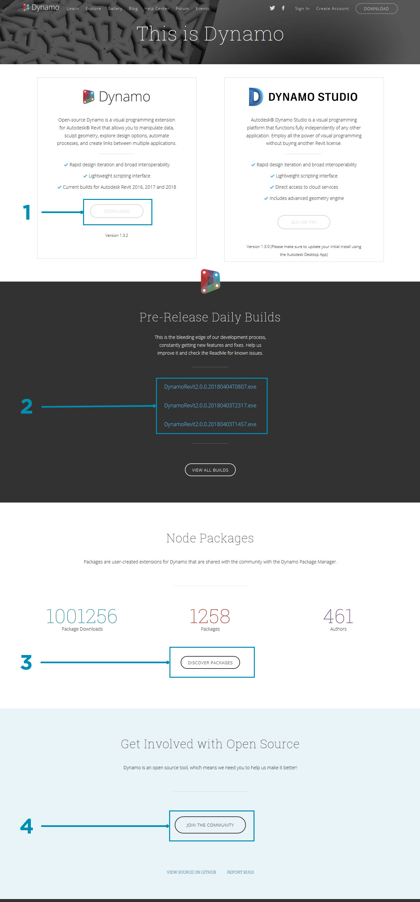
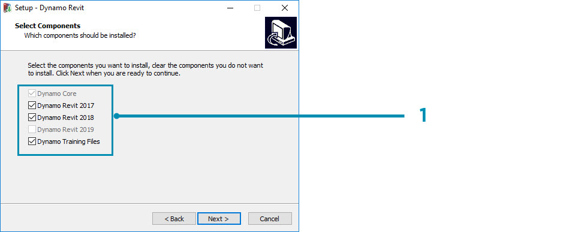
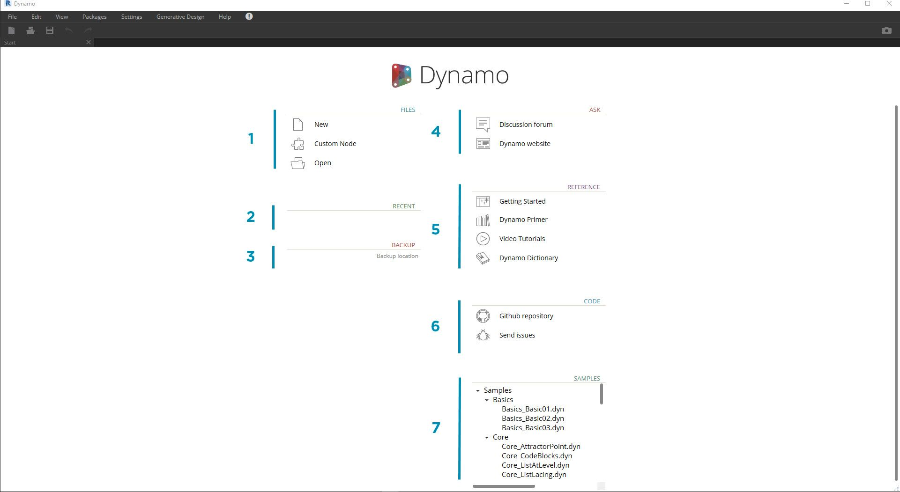

## Cài đặt và khởi chạy Dynamo

Dynamo là một dự án phát triển nguồn mở đang hoạt động với các trình cài đặt có thể tải xuống cho cả bản chính thức và bản phát hành trước, tức là những phiên bản "bản dựng hàng ngày". Tải xuống bản phát hành chính thức để bắt đầu hoặc đóng góp vào những gì Dynamo đang xây dựng thông qua các bản dựng hàng ngày hoặc dự án GitHub.

### Tải xuống

Để tải xuống phiên bản Dynamo được phát hành chính thức, hãy truy cập [Dynamo website](http://dynamobim.com/). Bắt đầu tải xuống nhanh chóng bằng cách nhấp vào từ trang chủ hoặc duyệt đến trang tải xuống chuyên dụng.

> 1. Xem video về Thiết kế tính toán với Dynamo cho Architecture
> 2. Hoặc duyệt đến trang tải xuống

Tại đây, bạn có thể tải xuống các phiên bản phát triển "phiên bản tối tân nhất" hoặc truy cập dự án [Dynamo Github](https://github.com/DynamoDS/Dynamo).

> 1. Tải xuống trình cài đặt bản phát hành chính thức
> 2. Tải xuống trình cài đặt bản dựng hàng ngày
> 3. Xem các gói tùy chỉnh từ cộng đồng các nhà phát triển
> 4. Tham gia vào quá trình phát triển Dynamo trên GitHub

### Cài đặt

Duyệt đến thư mục của trình cài đặt đã tải xuống và chạy tệp thực thi. Trong quá trình cài đặt, thiết lập cho phép bạn tùy chỉnh các phiên bản sẽ được cài đặt.

> 1. Chọn các phiên bản bạn muốn cài đặt

Ở đây chúng ta cần quyết định xem chúng ta có muốn bao gồm các phiên bản kết nối Dynamo với các ứng dụng được cài đặt khác như Revit hay không. Để biết thêm thông tin về Nền tảng Dynamo, hãy xem ** Chương 1.2 **.

### Khởi động

Để khởi chạy Dynamo, hãy duyệt tới \\ Program Files \ Dynamo \ Dynamo Revit \ x.y, sau đó chọn DynamoSandbox.exe. Thao tác này sẽ mở phiên bản độc lập và hiện lên _Trang bắt đầu_ của Dynamo. Trên trang này, chúng ta thấy các menu và thanh công cụ tiêu chuẩn cũng như một bộ sưu tập các phím tắt cho phép chúng ta truy cập chức năng tệp hoặc truy cập các tài nguyên bổ sung.

> 1. Files -Bắt đầu một tệp mới hoặc mở một tệp hiện có
> 2. Recent - Cuộn qua các tệp gần đây của bạn
> 3. Backup - Truy cập vào các bản sao lưu của bạn
> 4. Ask - Truy cập trực tiếp vào Diễn đàn Người dùng hoặc Trang web Dynamo
> 5. Reference - Tiến xa hơn với các tài nguyên học tập bổ sung
> 6. Code - Tham gia vào dự án phát triển mã nguồn mở
> 7. Samples - Xem các ví dụ đi kèm với cài đặt

Mở tệp mẫu đầu tiên để mở không gian làm việc đầu tiên của bạn và xác nhận Dynamo đang hoạt động chính xác. Chọn Samples > Basics > **Basics\_Basic01.dyn**.

> 1. Xác nhận rằng thanh thực thi đang đặt ở chế độ "Automatic" hoặc nhấp vào Run
> 2. Làm theo hướng dẫn và kết nối **Number** Node to the **+** Node
> 3. Xác nhận rằng Nút Watch này hiển thị kết quả

Nếu tệp này chạy thành công, có nghĩa là bạn đã thực hiện chương trình trực quan đầu tiên của mình với Dynamo.
