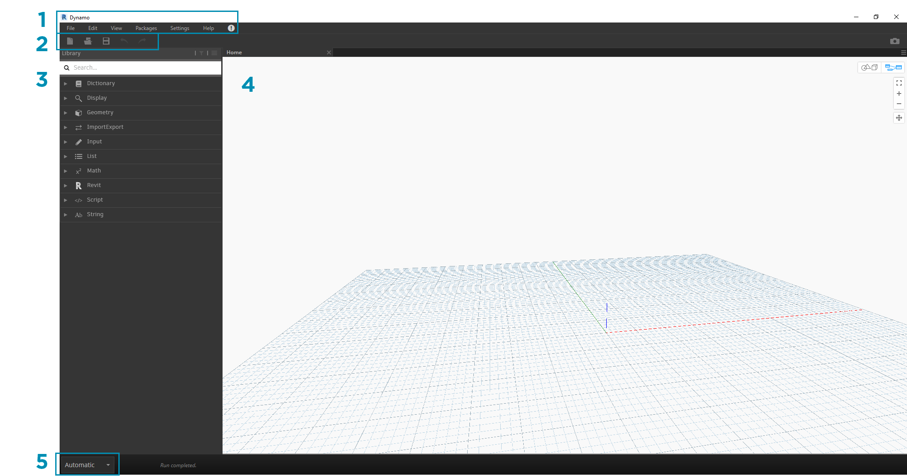
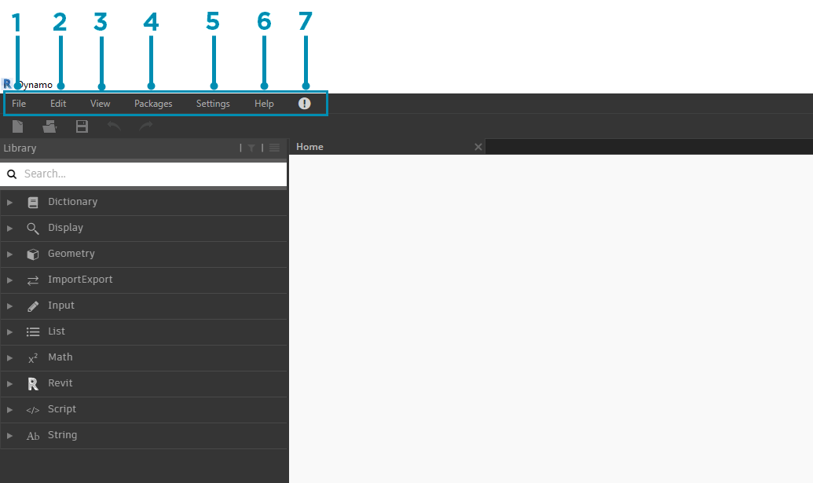
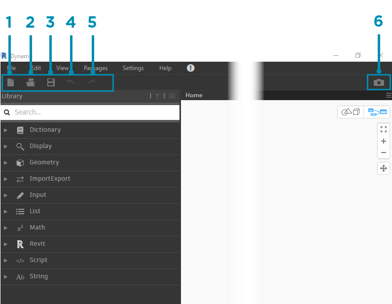
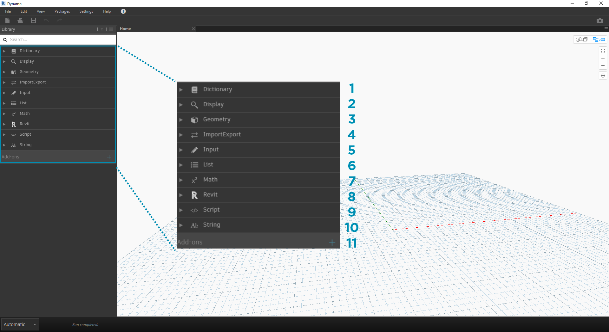
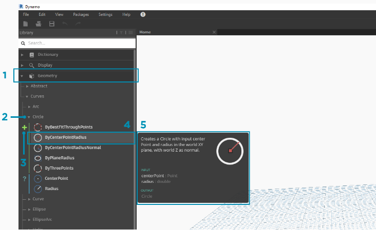
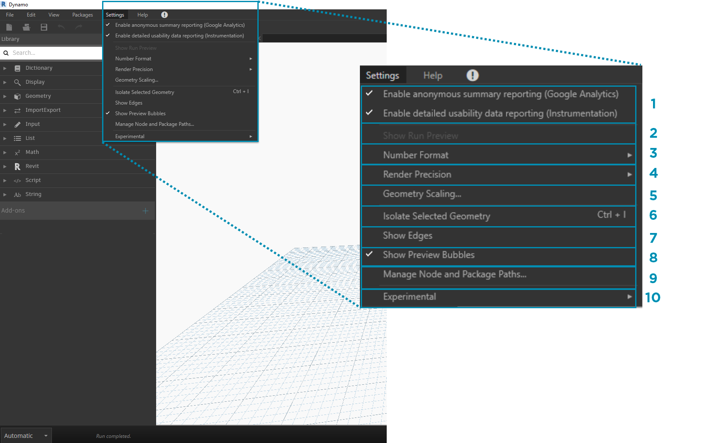
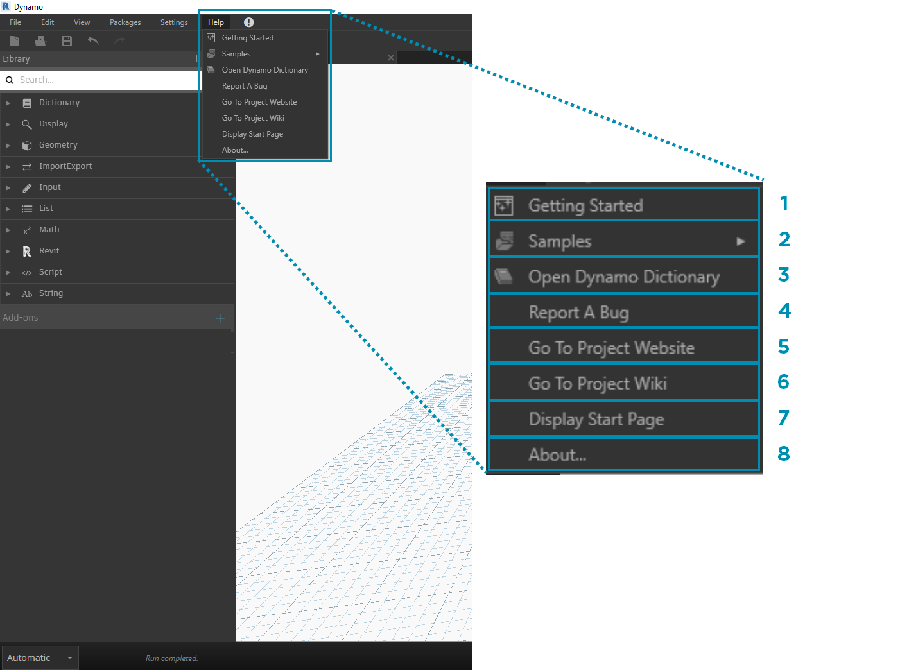

##Giao diện người dùng Dynamo

Giao diện người dùng (UI) cho Dynamo được tổ chức thành năm vùng chính, vùng lớn nhất là không gian làm việc nơi chúng tôi soạn các chương trình trực quan của mình.

>1. Thanh menus
>2. Thanh công cụ
>3. Thư viện
>4. Không gian làm việc
>5. Thanh thực thi

Hãy đi sâu hơn vào giao diện người dùng và khám phá chức năng của từng khu vực.

####Thanh Menus

Thanh Menu thả xuống là một nơi tuyệt vời để tìm một số chức năng cơ bản của ứng dụng Dynamo. Giống như hầu hết các phần mềm Windows, các hành động liên quan đến quản lý tệp và hoạt động để lựa chọn và chỉnh sửa nội dung được tìm thấy trong hai menu đầu tiên. Các menu còn lại là những hành động cụ thể hơn cho Dynamo.

> 1. Tệp
> 2. Chỉnh Sửa
> 3. Xem
> 4. Gói
> 5. Thiếp lập
> 6. Giúp đỡ
> 7. Thông báo

####Thanh công cụ

Thanh công cụ của Dynamo chứa một loạt các nút để truy cập nhanh vào làm việc với tệp cũng như các lệnh hoàn tác [Ctrl + Z] và làm lại [Ctrl + Y]. Ở ngoài cùng bên phải là một nút khác sẽ xuất ảnh chụp nhanh không gian làm việc, cực kỳ hữu ích cho việc chia sẻ và tài liệu.

> 1. New - Khởi tạo một tệp .dyn mới
> 2. Open - Mở tệp .dyn (không gian làm việc) hoặc .dyf (nút tùy chỉnh) hiện có
> 3. Save/Save As - Lưu tệp .dyn hoặc tệp .dyf đang hoạt động của bạn
> 4. Undo - Hoàn tác hành động cuối cùng của bạn
> 5. Redo - Làm lại hành động tiếp theo
> 6. Export Workspace as Image - Xuất không gian làm việc hiển thị dưới dạng tệp PNG

####Thư viện
Thư viện chứa tất cả các Nút đã tải, bao gồm các Nút mặc định đi kèm với cài đặt cũng như bất kỳ Gói hoặc Gói tùy chỉnh nào được tải thêm.Các nút trong Thư viện được tổ chức phân cấp trong các thư viện, danh mục, và nếu thích hợp, các danh mục con dựa trên việc các nút **Create** dữ liệu, thực thi **Action**, hoặc **Query** dữ liệu.

#####Browsing
Theo mặc định, **Thư viện** sẽ chứa hơn tám danh mục Nút. **Core** và **Geometry** là các menu tuyệt vời để bắt đầu khám phá vì chúng chứa số lượng nút lớn nhất. Duyệt qua các danh mục này là cách nhanh nhất để hiểu thứ bậc của những gì chúng ta có thể thêm vào Không gian làm việc của mình và là cách tốt nhất để khám phá các Nút mới mà bạn chưa sử dụng trước đây.

> Bây giờ chúng tôi sẽ tập trung vào bộ sưu tập mặc định của các Nút, nhưng lưu ý rằng chúng tôi sẽ mở rộng Thư viện này với các Nút tùy chỉnh, các thư viện bổ sung và trình quản lý gói sau này.

>1. Từ điển
>2. Hiển thị
>3. Hình học
>4. Nhập xuất
>5. Đầu vào
>6. Danh sách
>7. Tính toán
>8. Revit
>9. Kịch bản
>10. Chuỗi
>11. Add-ons

Duyệt qua Thư viện bằng cách nhấp qua các menu. Chọn vào Geometry > Curves > Circle. Lưu ý phần mới của menu được nhìn thấy và cụ thể là các nhãn **Create** và **Query**.

>1. Thư viện
>2. Danh mục
>3. Danh mục con: Create/Actions/Query
>4. Nút
>5. Mô tả nút và thông tin thuộc tính - điều này sẽ xuất hiện khi di chuột qua biểu tượng nút.

Từ cùng một menu Circle, di chuyển chuột qua **ByCenterPointRadius**. Cửa sổ sẽ hiển thị thông tin chi tiết hơn về nút ngoài tên và biểu tượng của nó. Điều này cung cấp cho chúng ta một cách nhanh chóng để hiểu những gì nút làm, những gì nó sẽ yêu cầu đối với đầu vào và những gì nó sẽ cung cấp dưới dạng đầu ra.

>1. Description - plain language description of the Node
>2. Icon - larger version of the icon in the Library Menu
>3. Input(s) - name,  data type, and data structure
>4. Output(s) - data type and structure

#####Tìm kiếm
Nếu bạn biết một cách tương đối cụ thể Node nào bạn muốn thêm vào không gian làm việc của mình, trường 'tìm kiếm' là một người bạn tốt nhất của bạn. Khi bạn không chỉnh sửa cài đặt hoặc chỉ định giá trị trong Không gian làm việc, con trỏ luôn hiện diện trong trường này.Nếu bạn bắt đầu nhập, Thư viện Dynamo sẽ hiển thị một kết quả phù hợp nhất đã chọn (với đường dẫn cho nơi có thể tìm thấy nó trong danh mục Nút) và danh sách các kết hợp thay thế cho tìm kiếm. Khi bạn nhấn Enter hoặc nhấp vào mục trong trình duyệt bị cắt ngắn, Nút được đánh dấu sẽ được thêm vào giữa Không gian làm việc.

>1. Search Field
>2. Best Fit Result / Selected
>3. Alternate Matches

###Settings
From geometric to user settings, these options can be found in the **Settings** menu. Here you can opt in or out for sharing your user data to improve Dynamo as well as define the application's decimal point precision and geometry render quality.

>1. Enabling Reporting - Options for sharing user data to improve Dynamo.
2. Show Run Preview - Preview the execution state of your graph. Nodes scheduled for execution will be highlighted in your graph.
3. Number Format Options - Change the document settings for decimals.
4. Render Precision - Raise or lower the document render quality.
5. Geometry Scaling - Select range of geometry you are working on.
6. Isolate Selected Geometry - Isolated background geometry based on your node selection.
7. Show/Hide Geometry Edges - Toggle 3D geometry edges.
8. Show/Hide Preview Bubbles - Toggle data preview bubbles below nodes.
9. Manage Node and Package Paths - Manage file paths to make nodes and packages show up in the Library.
10. Enabling Experimental Features - Use beta features new in Dynamo.

###Help
If you're stuck, check out the **Help** Menu. Here you can find the sample files that come with your installation as well as access one of the Dynamo reference websites through your internet browser. If you need to, check the version of Dynamo installed and whether it is up to date through the **About** option.

>1. Getting Started - A brief introduction to using Dynamo.
2. Samples - Reference example files.
3. Open Dynamo Dictionary - Resource with documentation on all nodes.
4. Report A Bug - Open an Issue on GitHub.
5. Go To Project Website - View the Dynamo Project on GitHub.
6. Go To Project Wiki - Visit the wiki for learning about development using the Dynamo API, supporting libraries and tools.
7. Display Start Page - Return to the Dynamo start page when within a document.
8. About - Dynamo Version data.
